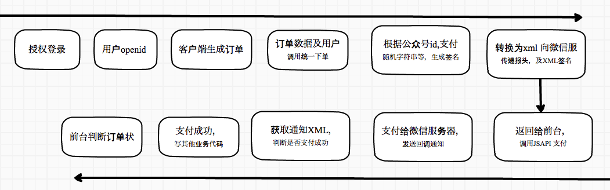

# JS-SDK


<h3 id="signature"> 1. 签名</h3>
​    
看到网上的大部分问题都集中在签名部分，请大家一定请熟读 

[微信JS-SDK说明文档](https://mp.weixin.qq.com/wiki?t=resource/res_main&id=mp1421141115) `附录5-常见错误及解决方法`

**注意**


* 在计算签名的过程中，如果url总是不对请 实验 `首页的url`或 window.location.href。 做到微信拿到真实路径与我们拿去生成签名的路径是一致的，千万记住这条

*  前端需要用js获取当前页面除去'#'hash部分的链接（可用location.href.split('#')[0]获取,而且需要encodeURIComponent

*  vue每次刷新页面，都需要重新配置SDK，**使用JS_SDK必须先注入配置信息**

*  [关于html5-History模式在微信浏览器内的问题 #481](https://github.com/vuejs/vue-router/issues/481)

*  IOS：微信IOS版，微信安卓版，每次切换路由，SPA的url是不会变的，发起签名请求的url参数必须是当前页面的url就是最初进入页面时的url(entryUrl.js)

*  Android：微信安卓版，每次切换路由，SPA的url是会变的，发起签名请求的url参数必须是当前页面的url(不是最初进入页面时的)(entryUrl.js)

*  登录微信公众平台进入“公众号设置”的“功能设置”里填写“JS接口安全域名”。

*  域名格式：如果你的项目域名是http://test.domain.com,那么JS接口安全域名为test.domain.com

*  timestamp: , // 生成签名的时间戳，精确到秒 秒  秒  秒  

*  nonceStr: '', // 必填，生成签名的随机串  

   ​    

```
// entryUrl.js
 全局存储进入SPA的url（window.entryUrl），Android不变，依旧是获取当前页面的url，IOS就使用window.entryUrl
// 记录进入app的url，后面微信sdk
if (window.entryUrl === '') {
  window.entryUrl = location.href.split('#')[0]
}
// 进行签名的时候
url: isAndroid() ? location.href.split('#')[0] : window.entryUrl
```

支付流程图



### 2. 签名 （后台）

后台生成签名后返回给前台使用，很多微信api需要这个签名。

生成后可以验证一下签名是否正确    [签名校验工具](http://work.weixin.qq.com/api/jsapisign)

```
//php
<?php
   namespace Vendor\wxpay;//命名空间
   /**
    * Class wxpay
    * @package Vendor\wxpay
    * @name 用于签名生产
    * @author weikai
    */
   class wxpay {
       private $appId;
       private $appSecret;

       public function __construct($appId, $appSecret) {
           $this->appId = $appId;
           $this->appSecret = $appSecret;
       }
       //获取签名
       public function getSignPackage() {
           $jsapiTicket = $this->getJsApiTicket();//获取JsApiTicket

           // vue管理路由 url参数建议前台传递
           $protocol = (!empty($_SERVER['HTTPS']) && $_SERVER['HTTPS'] !== 'off' || $_SERVER['SERVER_PORT'] == 443) ? "https://" : "http://";
           // $url = "$protocol$_SERVER[HTTP_HOST]$_SERVER[REQUEST_URI]";//如果后台获取url
           $url = I('get.frontUrl');//获取前台传递的url
           $timestamp = time();//现在时间戳
           $nonceStr = $this->createNonceStr();//生成随机字符串

           // 这里参数的顺序要按照 key 值 ASCII 码升序排序
           $string = "jsapi_ticket=$jsapiTicket&noncestr=$nonceStr&timestamp=$timestamp&url=$url";

           $signature = sha1($string);//sha1加密排序后的参数生产签名
   		//将所有参数赋值到数组
           $signPackage = array(
               "appId"     => $this->appId,
               "nonceStr"  => $nonceStr,
               "timestamp" => $timestamp,
               "url"       => $url,
               "signature" => $signature,
               "rawString" => $string
           );

           return $signPackage;
       }
     
   	//生成随机字符串
       private function createNonceStr($length = 16) {
           $chars = "abcdefghijklmnopqrstuvwxyzABCDEFGHIJKLMNOPQRSTUVWXYZ0123456789";
           $str = "";
           for ($i = 0; $i < $length; $i++) {
               $str .= substr($chars, mt_rand(0, strlen($chars) - 1), 1);
           }
           return $str;
       }
   	//生成JsApiTicket
       private function getJsApiTicket() {
           // jsapi_ticket 全局存储与更新
           $data = json_decode(S('jsapi_ticket'));
         //如果缓存中的JsApiTicket 不在有效期内重新生成JsApiTicket 
           if ($data->expire_time < time()) {
               $accessToken = $this->getAccessToken();//获取AccessToken
               // 如果是企业号用以下 URL 获取 ticket
               // $url = "https://qyapi.weixin.qq.com/cgi-bin/get_jsapi_ticket?access_token=$accessToken";
               $url = "https://api.weixin.qq.com/cgi-bin/ticket/getticket?type=jsapi&access_token=$accessToken";
               $res = json_decode($this->httpGet($url));
               $ticket = $res->ticket;
             //更新有效期存入缓存
               if ($ticket) {
                   $data->expire_time = time() + 7000;
                   $data->jsapi_ticket = $ticket;
                   S('jsapi_ticket',json_encode($data));
               }
           } else {
             //否则缓存中的JsApiTicket 在有效期内就直接用
               $ticket = $data->jsapi_ticket;
           }

           return $ticket;
       }
   	//获取全局AccessToken
       public function getAccessToken() {
           // access_token 全局存储与更新
           $data = json_decode(S('access_token'));
           if ($data->expire_time < time()) {
               // 如果是企业号用以下URL获取access_token
               // $url = "https://qyapi.weixin.qq.com/cgi-bin/gettoken?corpid=$this->appId&corpsecret=$this->appSecret";
               $url = "https://api.weixin.qq.com/cgi-bin/token?grant_type=client_credential&appid=$this->appId&secret=$this->appSecret";
               $res = json_decode($this->httpGet($url));
               $access_token = $res->access_token;
               if ($access_token) {
                   $data->expire_time = time() + 7000;
                   $data->access_token = $access_token;
                   S('access_token',json_encode($data));
               }
           } else {
               $access_token = $data->access_token;
           }
           return $access_token;
       }

       //curl 请求
       private function httpGet($url) {
           $curl = curl_init();
           curl_setopt($curl, CURLOPT_RETURNTRANSFER, true);
           curl_setopt($curl, CURLOPT_TIMEOUT, 500);
           // 为保证第三方服务器与微信服务器之间数据传输的安全性，所有微信接口采用https方式调用，必须使用下面2行代码打开ssl安全校验。
           // 如果在部署过程中代码在此处验证失败，请到 http://curl.haxx.se/ca/cacert.pem 下载新的证书判别文件。
           curl_setopt($curl, CURLOPT_SSL_VERIFYPEER, true);
           curl_setopt($curl, CURLOPT_SSL_VERIFYHOST, true);
           curl_setopt($curl, CURLOPT_URL, $url);

           $res = curl_exec($curl);
           curl_close($curl);

           return $res;
       }


   }
```

   ​


### 3. 签名（前台）

- [x] 微信配置
- [x] 微信扫一扫
- [x] 分享到朋友圈
- [x] 朋友的设置
- [x] 分享的基本配置
- [x] 微信支付

```
/**
 * WECHAT.js
 * Created by  isam2016 
 */

import wx from 'weixin-js-sdk';
import axios from 'axios';

var JsWeChatApis = [
  'checkJsApi',
   请补全列表
];

var isWeChatReady = false;// 检查微信wx.ready
 
export default class AlWeChat {
  constructor(object) {
    this.object = object;// vue 需要使用vue 解决回调
    this.wxConfig();// 初始微信配置
  }
  /**
   * 微信配置
   * @Author   Hybrid
   * @DateTime 2017-11-21
   */
  wxConfig() {
    let self = this;
    axios.get('/home/OrderConfirm/wxConfig', {
      params: {
        frontUrl: location.href.split('#')[0]// 前台吧url 传到后台 而且需要encodeURIComponent，
      }
    }).then(function(response) {
      var attachment = response.data.data;// 后台统一调配数据，返回前台
      // console.log(attachment);
      wx.config({
        debug: false,
        appId: attachment.appId,
        timestamp: attachment.timestamp, // 支付签名时间戳小写s 时间戳(timestamp)值要记住精确到秒，不是毫秒。
        nonceStr: attachment.nonceStr,//支付签名随机串，不长于 32 位,大写s
        signature: attachment.signature,
        url: attachment.url,
        jsApiList: JsWeChatApis
      });
      wx.ready(function () {
        isWeChatReady = true;
        self.object && self.wxQDetailShare()//分享到朋友圈+朋友的设置
      });
      wx.error(function (res) {
        //console.log(JSON.stringify(res));
      });

    }).catch(function (error) {
      // console.log(error)
    });
  }

  /**
   * 微信扫一扫
   * @Author   Hybrid
   * @DateTime 2017-11-21
   * @return   {[type]}   [description]
   */
  wxScanQRCode(fn) {
    wx.scanQRCode({
      needResult: 1, // 默认为0，扫描结果由微信处理，1则直接返回扫描结果，
      scanType: ["qrCode"], // 可以指定扫二维码还是一维码，默认二者都有
      success: function (res) {
        var result = res.resultStr; // 当needResult 为 1 时，扫码返回的结果
        fn(result);
      }
    });
  }

  /**
   * 分享到朋友圈+朋友的设置
   * 可以动态设置
   * @Author   Hybrid
   * @DateTime 2017-11-21
   * @param    {}   data [展示数据]
   * @param    {[type]}   eqid [description]
   * @return   {[type]}        [description]
   */
  wxQDetailShare() {
    var config = {
      title: 'XXX',
      desc: 'XXX',
      imgUrl: 'XXX',
      link: 'XXX',
    };
    var shareConfig = {
      message: config,
      timeLine: {
        title: config.title,
        desc: config.desc,
        imgUrl: config.imgUrl,
        link: config.link,
      },
    };
    this.wxShare(shareConfig);
  }

  /**
   * 分享的基本配置
   * @Author   Hybrid
   * @DateTime 2017-11-21
   * @param    {}   shareConfig [不同类型的分享有不同的配置]
   * @return   {[type]}               [description]
   */
  wxShare(shareConfig) {
    let self = this;
    if (isWeChatReady) {
      /**
       * 分享到朋友圈
       * @Author   Hybrid
       */
      wx.onMenuShareTimeline({
        title: shareConfig.timeLine.title, // 分享标题
        link: shareConfig.timeLine.link, // 分享链接
        imgUrl: shareConfig.timeLine.imgUrl, // 分享图标
        success: function () {
          self.object.closecovershow();// 回调
          // 用户确认分享后执行的回调函数
        },
        cancel: function () {
          self.object.closecovershow();
          // 用户取消分享后执行的回调函数
        }
      });

      /**
       * 分享给朋友
       * @Author   Hybrid
       */
      wx.onMenuShareAppMessage({
        title: shareConfig.message.title, // 分享标题
        desc: shareConfig.message.desc, // 分享描述
        link: shareConfig.message.link, // 分享链接
        imgUrl: shareConfig.message.imgUrl, // 分享图标  type: '', // 分享类型,music、video或link，不填默认为link
        type: '', // 分享类型,music、video或link，不填默认为link
        dataUrl: '', // 如果type是music或video，则要提供数据链接，默认为空
        success: function () {
          self.object.closecovershow();
          // 用户确认分享后执行的回调函数
        },
        cancel: function () {
          self.object.closecovershow();
          // 用户取消分享后执行的回调函数
        }
      });
    }
  }


  /**
   * 微信支付
   * @Author   Hybrid
   * @DateTime 2017-11-21
   * @param    {string}   router 单页面应用，由前台通知URL
   * @return   {[type]}          [description]
   */
  payWeChat(order_num) {
    let self = this;
    axios.get('/home/OrderConfirm/orderPay', {
      params: {
        type: 'weixin',
        frontUrl: location.href.split('#')[0],
        order_num// 订单号
      }
    }).then(function (response) {
      var attachment = response.data.data;// 后台返回参数
      localStorage.setItem(wechatCode, '');
      //alert(location.href)
      WeixinJSBridge.invoke('getBrandWCPayRequest', {
        "appId": attachment.appId,
        "timeStamp": attachment.timeStamp, // 大写S
        "nonceStr": attachment.nonceStr, // 大写S
        "package": attachment.package,
        "signType": 'MD5',
        "paySign": attachment.paySign,
      }, function (res) {
        // console.log(res);
        if (res.err_msg == "get_brand_wcpay_request:ok") {
          self.object.$router.push("/paysuccess");
        } else if (res.err_msg == "get_brand_wcpay_request:cancel") {
          self.object.$router.push("/ordercenter");
        } else {
          // localStorage.setItem(wechatCodeOld, '');
          localStorage.setItem(wechatCode, '');
          //alert("支付失败!" + JSON.stringify(res) + "当前路径" + location.href);
          // alert("支付失败!" + JSON.stringify(res));
          //   resolve(-1);
        }
      })

    }).catch(function (err) {
      console.log(JSON.stringify(err));
    })
  }
}
```

在前端调用
```
/**
 * 注入配置
 * this 是 vue
 * 注意： 分享到朋友圈或分享到朋友，每个页面都需要配置.所以最好在每个页面调用一下 注入配置
 */
var WeChat = new AlWeChat(this) 
WeChat.payWeChat(12345678) // 调用支付
WeChat.wxScanQRCode(fn) // 扫一扫

```

### 3.微信支付

  * 支付申请：微信支付 - 公众号支付 -

  * [微信支付文档](https://pay.weixin.qq.com/wiki/doc/api/index.html)

  * 请仔细阅读[公众号支付开发步骤](https://pay.weixin.qq.com/wiki/doc/api/jsapi.php?chapter=7_3)  

  * 设置[支付目录](https://pay.weixin.qq.com/index.php/extend/pay_setting)

  * **设置支付授权目录注意3点：**

      * 所有使用公众号支付方式发起支付请求的链接地址，都必须在支付授权目录之下；

      * 最多设置5个支付授权目录，且域名必须通过ICP备案；

      * 头部要包含http或https，须细化到二级或三级目录，以左斜杠“/”结尾。


  * 设置支付授权目录的具体规则是这样的：

      * 非单页面应用，把URL最后一个反斜杠后面的内容去
      * 单页面应用（vue) 为了解决安卓和IOS 支付效果不一致问题，我们通常会在url 中添加a=1(前边已经提到过),保留问号之前内容（eg:6）
        >[开发单页应用(SPA)时候遇到的微信支付授权目录的坑](https://www.tuicool.com/articles/mQ7RRfb)

```
1

比如：调用支付的页面地址为 http://a.b.com/pay/weixin/c.html，`
那么：授权目录配置为 http://a.b.com/pay/weixin/`
```

```
2
     
比如：调用支付的页面地址为 http://a.b.com/pay/weixin，
那么：授权目录配置为 http://a.b.com/pay/
```

```
3

比如：调用支付的页面地址为 http://a.b.com/pay，
那么：授权目录配置为 http://a.b.com/
```

```
4

比如：调用支付的页面地址为  http://a.b.com/pay/weixin/c.html？name=mango，
那么：授权目录配置为  http://a.b.com/pay/weixin/
```

```
5(vue spa)

 比如：调用支付的页面地址为  http://a.b.com/#/pay/weixin/c.html？name=mango
 那么：授权目录配置为   http://a.b.com/
```

```
6(vue spa)

 比如：调用支付的页面地址为  http://a.b.com/#!/cart/index（通常我们会改变URL http://a.b.com/?#!/cart/index）
 那么：授权目录配置为   http://a.b.com/
```


我们在网页授权的时候改变url
```
 location.href = `http://m.example.com/?a=1#${location.href.split('#')[1]}`; // 增加a=1 防止支付错误 防止前台死循环
```


PHP

我们基于微信支付官方demo做了优化（微信公众号支付）

源码目录	:

```
wxpay\wxjsapi.php
```

使用方法:

#### 1. 将源码文件放到Thinkphp框架如下目录内

```
   项目名/ThinkPHP/Library/Vendor/wxpay/wxjsapi.php
```

#### 2. 微信支付方法

只需导入sdk文件，实例化sdk类 调用getParameters方法传入订单数据
```
 /*
  * php
  * @name 微信支付
  * @author weikai
  */
 public function orderPay(){
     $type = I('get.type');
     //微信jsapi 支付
     if($type=='weixin'){
         // 导入微信支付sdk
         Vendor('wxpay.wxjsapi');
         $wxpay=new \Weixinpay();//实例化sdk类
      	//获取订单数据传入sdk  getParameters方法中
          $order_num = I('get.order_num');
          $orderData = M('order')->where('order_number='.$order_num)->find();
          if($orderData){
              $data=$wxpay->getParameters($orderData);
          }else{
              return $this->ajaxReturn(show(0,'无此订单'));
          }
		//最后返回支付签名信息及预支付id
         if($data){
             return $this->ajaxReturn(show(1,'签名信息',$data));
         }else{
             return $this->ajaxReturn(show(0,'签名信息失败'));
         }
     }
 }
```


##### 3. 微信SDK    getParameters方法配置 （路径：wxpay\wxjsapi.php内）

```
    /**
    * 获取jssdk需要用到的数据
    * @return array jssdk需要用到的数据
    */
   	public function getParameters($orderData){
           $order=array(
               'body'=>"商品描述".$orderData['order_number'],// 商品描述（需要根据自己的业务修改）
               'total_fee'=>$orderData['total_price']*100,// 订单金额  以(分)为单位（需要根据自己的业务修改）
               'out_trade_no'=>$orderData['order_number'],// 订单号（需要根据自己的业务修改）
               'product_id'=>'10001',// 商品id（需要根据自己的业务修改）
               'trade_type'=>'JSAPI',// JSAPI公众号支付
               'openid'=>session('openid')// 获取到的openid
           );
           // 统一下单 获取prepay_id 具体参照源文件内
           $unified_order=$this->unifiedOrder($order);
           // 获取当前时间戳
           $time=time();
           // 组合jssdk需要用到的数据
           $config = $this->config;
           $data=array(
               'appId'=>$config['APPID'], //appid
               'timeStamp'=>strval($time), //时间戳
               'nonceStr'=>$this->getNonceStr(32),// 随机字符串
               'package'=>'prepay_id='.$unified_order['prepay_id'],// 预支付交易会话标识
               'signType'=>'MD5'//加密方式
           );
           // 生成签名
           $data['paySign']=$this->makeSign($data);
       
           return $data;
       
       }
     }
```

​    成功返回信息如图：

   

返回参数说明：

>appId：微信公众号标识

>nonceStr：随机字符串

>prepay_id：微信生成的预支付会话标识，用于后续接口调用中使用，该值有效期为2小时

>paySign：支付签名

>signType：签名类型

>timeStamp：时间戳


4.前端处理支付 
 在 WECHAT.js 中paywechat方法

5.支付结果通知

```php
 	/**
     * 微信公众号支付回调验证
     * @return array 返回数组格式的notify数据
     */
    public function notify(){
         Vendor('wxpay.wxjsapi');//引入sdk
         $wxpay=new \Weixinpay();//实例化sdk类
        // 获取微信支付通知的xml数据
        $xml=file_get_contents('php://input', 'r');
        
        // 转成php数组
        $data=toArray($xml);
        // 保存原sign
        $data_sign=$data['sign'];
        // sign不参与签名
        unset($data['sign']);
        $sign=$wxpay->makeSign($data);
        // 判断签名是否正确  判断支付状态
        if ($sign===$data_sign && $data['return_code']=='SUCCESS' && $data['result_code']=='SUCCESS') {
            $result=$data;
            //将支付状态更新进订单表
           //其他业务代码
        }else{
            $result=false;
        }
        // 返回状态给微信服务器
        if ($result) {
            $str='<xml><return_code><![CDATA[SUCCESS]]></return_code><return_msg><![CDATA[OK]]></return_msg></xml>';

        }else{
            $str='<xml><return_code><![CDATA[FAIL]]></return_code><return_msg><![CDATA[签名失败]]></return_msg></xml>';
        }
        echo $str;
        return $result;
    }

```

toArray -XML转换数组的函数

```
 /**
 * php
 * 将xml转为array
 * @param  string $xml xml字符串
 * @return array       转换得到的数组
 */
function toArray($xml){   
  //禁止引用外部xml实体
  libxml_disable_entity_loader(true);
  $result= json_decode(json_encode(simplexml_load_string($xml, 'SimpleXMLElement', LIBXML_NOCDATA)), true);        
  return $result;
}
```


6.前台轮询判断订单支付状态，成功给用户提示。


